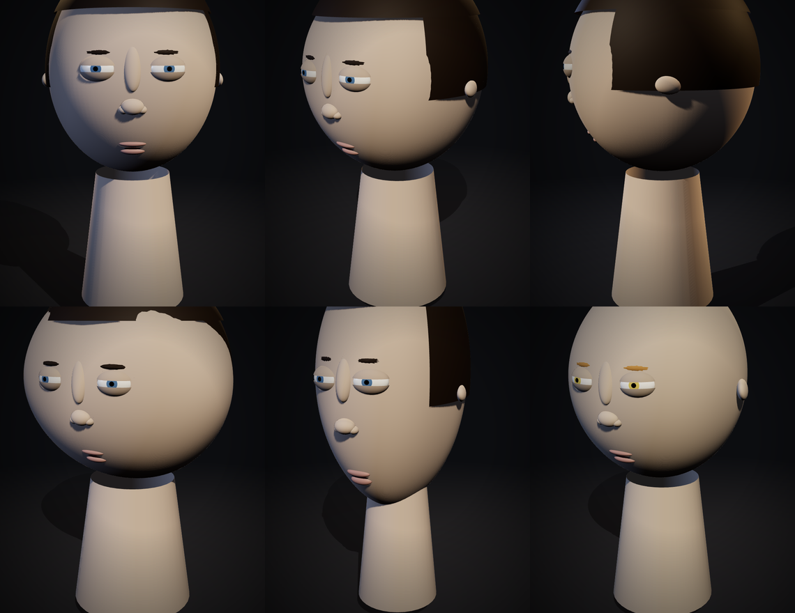

# Noblivion Character Creator

A slider-driven 3D character creator in the spirit of classic RPG character
generation screens — built as a single, dependency-light HTML page.

**Live:** https://moai-heads.github.io/noblivion/



## What it does

The head is a procedurally deformed sphere. Every slider drives a smooth
gaussian-region deformation of the skull mesh (jaw, chin, cheekbones, brow
ridge) or moves/scales a feature mesh (eyes, nose, lips, ears, hair). Nothing is
pre-baked, so every combination is a valid face.

Sliders follow the Oblivion layout:

| Tab | Controls |
|---|---|
| Lineage | 10 generic lineage presets with shape + colour palettes, gender, skin tone, eye/hair colour |
| Face | face W/H/D, jaw W/H/D, cheekbone W/H/D, chin W/H/D, brow W/H/D |
| Nose | width, length, height, tip |
| Mouth | width, height, lip size |
| Eyes | width, height, depth, separation, tilt |
| Ears | size, height, tilt |
| Hair | bald / short / long / tail / mohawk / bun + tint |

Plus **Random**, **Reset**, an auto-spin toggle and **Save** (downloads a PNG
portrait). Drag to orbit, scroll to zoom. Works on touch.

## Tech

- [three.js](https://threejs.org/) (ES module + importmap, loaded from jsDelivr)
- ~12.5k vertex skull, deformed on the CPU per slider event
- Eyes are spherical caps with lid shells; iris/pupil are discs projected onto
  the sclera ellipsoid so they never sink inside it
- Every feature is anchored by sampling a height field rasterised from the
  *deformed* vertices, not from an analytic ellipsoid — so nose, lips, brows and
  eyes track the surface exactly as the sliders move
- No build step. No bundler. One file.

## No third-party content

The lineage palettes and names are generic (Frostkin, Lowlander, Hillfolk,
Sunlander, Ashen, Tallfolk, Woodkin, Ironskin, Catfolk, Scaleback). Nothing here
is derived from, or named after, any existing game's setting.

## Run locally

```bash
python3 -m http.server 8000
# open http://localhost:8000
```

Opening `index.html` straight off the filesystem also works in browsers that
allow module imports over `file://` — a local server is safer.

## Deploy

Push this folder to a repo and enable GitHub Pages (Settings → Pages → Deploy
from branch → `main` / root). That's it.
